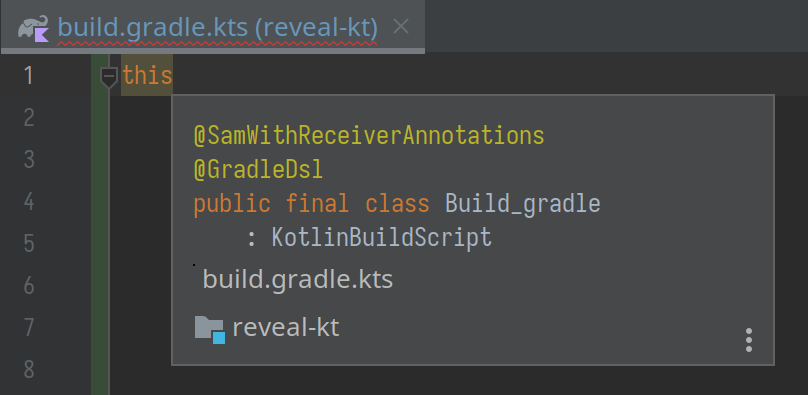

+++
title = "Используем Kotlin Script для конфигурации через DSL (IN-PROGRESS)"
slug = "kotlin-script"
date = 2022-12-02
[taxonomies]
tags = ["kotlin"]
draft = true
+++

Если вы знакомы с Gradle, то скорее всего, вам уже доводилось сталкиваться
с конфигурацией через Kotlin Script (.kts) и вы оценили удобство Kotlin и возможности не только подсветки синтаксиса, но и интеллектуального дополнения, основанного на строгой типизации. Поговорим о том, как это работает и как в своём приложении реализовать конфигурацию через DSL с помощью Kotlin Script.

{{danger(text = "DISCLAIMER")}}: На момент написания статьи Kotlin Script всё еще находится в альфа-версии и его API довольно неинтуитивно, нестабильно и не рекомендуется к использованию в критичных местах

<!-- more -->

План:
1. Kotlin Script на примере Gradle kts
1. Script definition
1. Script loader
1. Собираем всё вместе

## Kotlin Script на примере Gradle kts

Когда я только начинал разбираться с Gradle, мне никак не давалась концепция его конфигурации, и только когда я наконец осознал, что `build.gradle.kts` - это не скрипт сборки (подобный `ant`-скриптам), а скрипт конфигурации сборки, я смог уложить всё в голове.

То есть сам `build.gradle.kts` - лишь "кусочек" большого объекта конфигурации сборки:

Т.е. для `kts` файлов мы можем указать, в контексте какого объекта он будет выполняться.